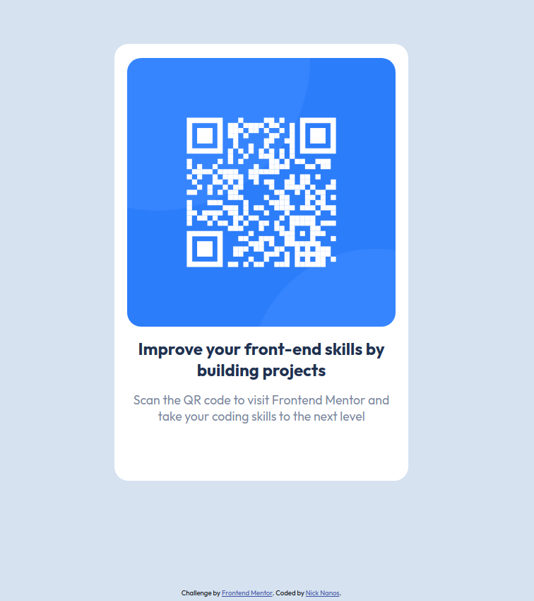

# Frontend Mentor - QR code component solution

This is a solution to the [QR code component challenge on Frontend Mentor](https://www.frontendmentor.io/challenges/qr-code-component-iux_sIO_H). Frontend Mentor challenges help you improve your coding skills by building realistic projects. 

## Table of contents

- [Overview](#overview)
  - [Screenshot](#screenshot)
  - [Links](#links)
  - [My process](#my-process)
  - [Built with](#built-with)
  - [What I learned](#what-i-learned)
  - [Useful resources](#useful-resources)
- [Author](#author)
- [Acknowledgments](#acknowledgments)

## Overview

### Screenshot




### Links

- Solution URL: [Code](https://github.com/nicknanos/qr-code-component)
- Live Site URL: [Live Demo](https://nicknanos.github.io/qr-code-component/)

## My process

### Built with

- Semantic HTML5 markup
- CSS custom properties
- Flexbox

### What I learned

Started using relative CSS units.
ex.:

```css
  .container {
    padding: 1.3rem 1rem 5rem 1rem;
  }
```

### Useful resources

- [CSS values and units](https://developer.mozilla.org/en-US/docs/Learn/CSS/Building_blocks/Values_and_units)

## Author

- Twitter - [@NickNanos5](https://twitter.com/NickNanos5)
- LinkedIn - [Nick Nanos](https://www.linkedin.com/in/nicknanos7/)
- Frontend Mentor - [@nicknanos](https://www.frontendmentor.io/profile/nicknanos)

## Acknowledgments

Big thanks to [KevinJPowell](https://twitter.com/KevinJPowell) and his [amazing video](https://www.youtube.com/watch?v=N5wpD9Ov_To) on
css units that convinced me to start using relative css units for better design.


